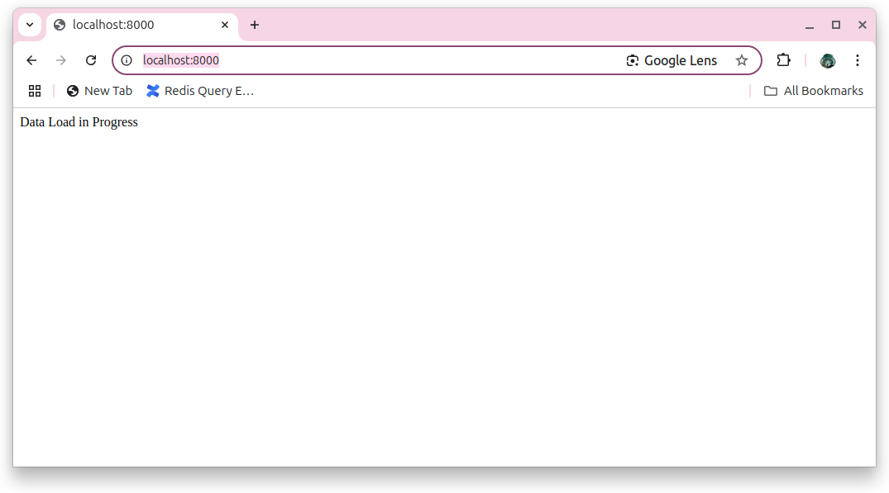
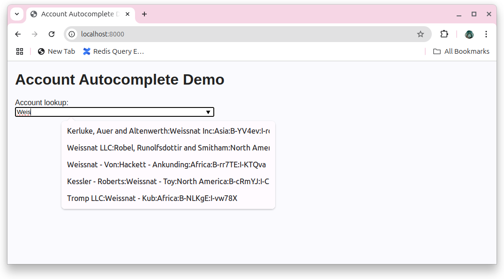
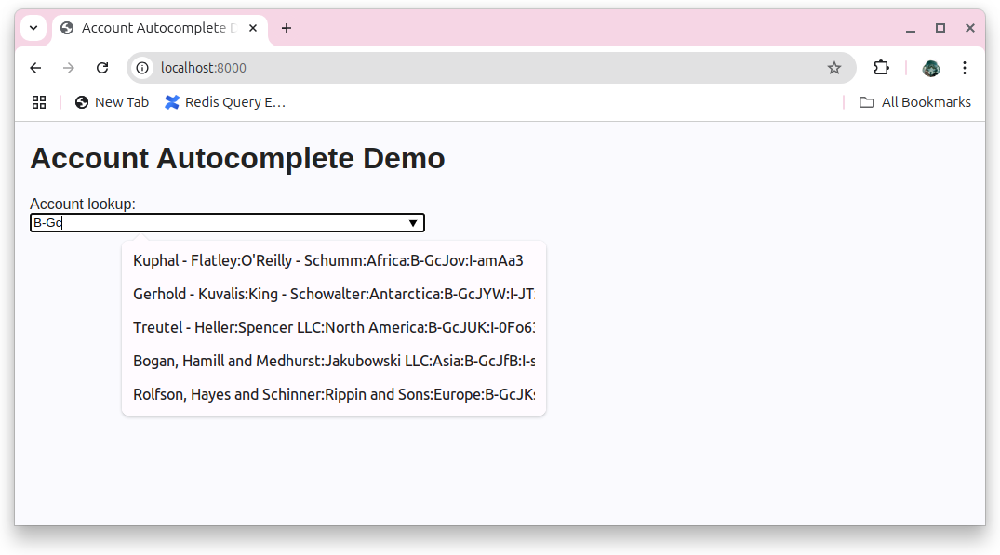

# Redis Account Auto-complete

## Contents
1.  [Summary](#summary)
2.  [Features](#features)
3.  [Prerequisites](#prerequisites)
4.  [Installation](#installation)
5.  [Usage](#usage)
6.  [Screenshots](#screenshots)


## Summary <a name="summary"></a>
This is a Javascript-based demo of Redis Suggest functionality.  Synthetic account data is generated with Faker (1M accounts).  Each account has the following fields:  
- name:         fake account name
- subsidiary:   fake account name
- region:       one of the continents
- branch code:  'B-' and a random 5 character alphanumeric
- internal code: 'I-' and a random 5 character alphanumeric

Name, subsidiary, branch and internal code are all added to 1 Redis Suggest dictionary.  Each dictionary entry has a payload field equal to the full colon-separated concatenation of all the fields for that account.  Example:
```bash
> FT.SUGGET acctDict Weis WITHPAYLOADS
1) "Weissnat Inc"
2) "Kerluke, Auer and Altenwerth:Weissnat Inc:Asia:B-YV4ev:I-rdW1C"
3) "Weissnat LLC"
4) "Weissnat LLC:Robel, Runolfsdottir and Smitham:North America:B-lpgjB:I-hhC3y"
5) "Weissnat - Von"
6) "Weissnat - Von:Hackett - Ankunding:Africa:B-rr7TE:I-KTQva"
7) "Weissnat - Toy"
8) "Kessler - Roberts:Weissnat - Toy:North America:B-cRmYJ:I-CIbiI"
9) "Weissnat - Kub"
10) "Tromp LLC:Weissnat - Kub:Africa:B-NLKgE:I-vw78X"
```


## Features <a name="features"></a>
- ExpressJS-based REST API server, synthetic data generation + load functionality, and HTML GUI to demonstrate address autocomplete.

## Prerequisites <a name="prerequisites"></a>
- Docker
- Docker Compose

## Installation <a name="installation"></a>
```bash
git clone https://github.com/Redislabs-Solution-Architects/address-ac.git && cd address-ac
```

## Usage <a name="usage"></a>
### Start-up
```bash
./start.sh
```
### Shutdown
```bash
./stop.sh
```
### GUI Access
```bash
http://localhost:8000
```
## Screenshots
### Data Load
This screen is displayed until all 1M entries have been loaded into Redis.

### Name Auto-complete (Account or Subsidiary)

### Branch Code Auto-complete (Account or Subsidiary)
